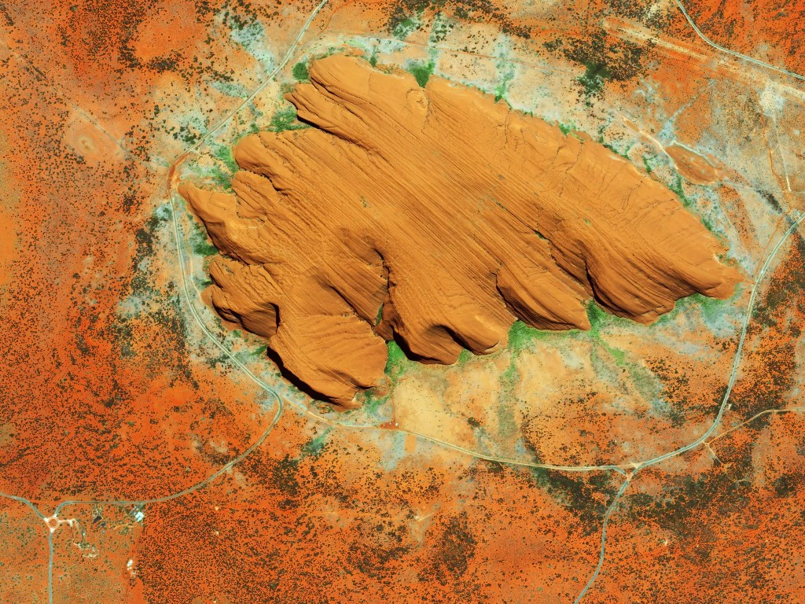

# slippymath
[](https://www.tidyverse.org/lifecycle/#experimental)

R functions for dealing with slippy map tile servers (Google maps, Open Street Map, Mapbox, Stamen et. al.).

# Usage


## Tile maths
Look at how many tiles you might need: 
```r
library(sf)

uluru_bbox <-
  st_bbox(c(xmin = 131.02084,
            xmax = 131.0535,
            ymin = -25.35461,
            ymax = -25.33568),
          crs = st_crs("+proj=longlat +ellps=WGS84"))

bb_tile_query(uluru_bbox)

# A tibble: 17 x 8
#    x_min  y_min  x_max  y_max y_dim x_dim total_tiles  zoom
#    <dbl>  <dbl>  <dbl>  <dbl> <dbl> <dbl>       <dbl> <int>
# 1      3      2      3      2     1     1           1     2
# 2      6      4      6      4     1     1           1     3
# 3     13      9     13      9     1     1           1     4
# 4     27     18     27     18     1     1           1     5
# 5     55     36     55     36     1     1           1     6
# 6    110     73    110     73     1     1           1     7
# 7    221    146    221    146     1     1           1     8
# 8    442    293    442    293     1     1           1     9
# 9    884    586    884    586     1     1           1    10
#10   1769   1173   1769   1173     1     1           1    11
#11   3538   2346   3539   2346     1     2           2    12
#12   7077   4692   7078   4692     1     2           2    13
#13  14154   9384  14156   9385     2     3           6    14
#14  28309  18769  28312  18771     3     4          12    15
#15  56619  37538  56625  37542     5     7          35    16
#16 113239  75076 113251  75084     9    13         117    17
#17 226478 150153 226502 150168    16    25         400    18
```

Get a grid of slippy map tile coordinates for a bounding box, given a `zoom`, or
guess a zoom given a `max_tiles`:

```r
bb_to_tg(uluru_bbox, max_tiles = 15)

#$tiles
#       x     y
#1  28309 18769
#2  28310 18769
#3  28311 18769
#4  28312 18769
#5  28309 18770
#6  28310 18770
#7  28311 18770
#8  28312 18770
#9  28309 18771
#10 28310 18771
#11 28311 18771
#12 28312 18771
#
#$zoom
#[1] 15
#
#attr(,"class")
#[1] "tile_grid"
```

Fetch a grid using your favourite tile server API. Here's a Mapbox example:

```r

library(purrr)
library(curl)
library(glue)

tile_grid <- bb_to_tg(uluru_bbox, max_tiles = 15)

mapbox_query_string <-
  paste0("https://api.mapbox.com/v4/mapbox.satellite/{zoom}/{x}/{y}.jpg90",
         "?access_token=",
         Sys.getenv("MAPBOX_API_KEY"))

images <-
  pmap(tile_grid$tiles,
       function(x, y, zoom){
         outfile <- glue("{x}_{y}.jpg")
         curl_download(url = glue(mapbox_query_string),
                       destfile = outfile) 
         outfile 
       },
       zoom = tile_grid$zoom)

```

## Tile compositing

You can composite a list of images and a corresponding tile grid to a spatially
referenced raster, meaning you can plot over it with `tmap` etc.

```r
library(raster)
library(rgdal)

raster_out <- tg_composite(tile_grid, images)

rgdal::writeGDAL(as(raster_out,
                    "SpatialGridDataFrame"), "uluru.png", driver = "PNG")

```
Result:


© <a href='https://www.mapbox.com/about/maps/'>Mapbox</a> © <a href='http://www.openstreetmap.org/copyright'>OpenStreetMap</a> <strong><a href='https://www.mapbox.com/map-feedback/' target='_blank'>Improve this map</a></strong>
